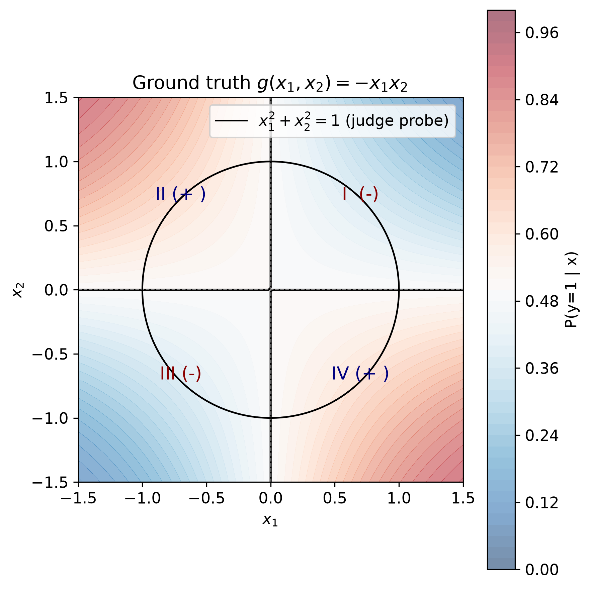

# Can your XAI method recover a simple decision rule? 

One model, one simple rule, and two inputs. The explanation methods tested herein can report feature attributions at arbitrary points accurately, yet none recovers the target rule. The capabilities and limits of XAI methods have been widely discussed in the literature [1]. Building on that prior work, this is a minimal demonstration of that exact attribution is not a decision rule.

## 1. Setup
Model $g(x_1,x_2)=-x_1x_2$. The rule labels the positive class when $x_1x_2<0$ and negative class when $x_1x_2>0$. The logit is positive when the two inputs have opposite signs and negative when they share the same sign. This is a sign XOR.

We treat the model as a black box and probe its input and output using mainstream XAI methods to see whether the decision logic can be recovered.

## 2. Grading

Four levels are defined based on the outputs. 
L1: the method outputs a unified rule that satisfies ${sign}(h(x))={sign}(g(x))$ almost everywhere with no restriction to polynomial or logical forms. This is the perfect target. 
L2: the method produces signs consistent with the rule sign at every valid probe point. It does not require numerical stability or a globally valid rule, and it is looser than L1.
L3: the method outputs an interaction term. However, at least one probe point has a component with sign opposite to the rule. At this level the term may line up with the true rule, or it may be completely reversed.
L4: the method produces no interaction terms. This is a factual property of the output format independent of probe points.

## 3. Results
Probe points are 16 points on the unit circle with $\theta=\pi/16+k\pi/8$, without zero components everywhere. The runs at baseline $b=(\tfrac12,\tfrac12)$ also avoids $x_i=\tfrac12$.

Additive methods assign contributions to individual features. SHAP outputs $(\phi_1,\phi_2)$[2]. LIME outputs local linear coefficients[3]. IG outputs $(IG_1,IG_2)$[4]. Counterfactual methods return a boundary point plus an offset per sample[5]. All four are rated L4.

Methods supporting second order interaction include Harsanyi/Moebius[6], SHAP-IQ/SII implemented in shapiq[7], and the official AOG implementation[8]. Each runs under $\(b=0\)$ and $b=(\tfrac12,\tfrac12)$. One SII run uses a symmetric background, with values equivalent to those at $\(b=0\)$. They output interaction term per sample. All six are at L3. Their interaction attributions share the same sign as the true rule at eight probe points and the opposite sign at the other eight ones.

## 4. Why They Fail
At $b=0$ exact additive Shapley values split the logit evenly, $\phi_1=\phi_2=-\tfrac12 x_1x_2$, and $\phi_1+\phi_2=g(x)$; IG returns those same two numbers. Pointwise matching does not encode the interaction rule.

Interaction methods can deliver perfect interaction term at any point. Yet they only return pointwise numerical values of the analytic form $(-1)\cdot(x_1x_2)$ . Without prior knowledge of the basis, no unique rule can be reconstructed from these values. For example, at $(1,1)$ the returned value is the number $-1$. The expression $(-1)\cdot(x_1^nx_2^n)$ produces this value for any real $n$.

## 5. No Prior, No Guarantee
Proposition. Methods relying only on black box single point queries with fixed randomness cannot guarantee outputting a correct rule for every target almost everywhere.

Proof. Consider one run of method A against a target $g$. Let $Q$ denote queried points and $h$ the output. Queries are made sequentially so $Q$ is at most countable and has measure zero. The next query location depends only on observed values so far. If another target $g'$ matches $g$ everywhere on $Q$ the observations seen by A are identical pointwise and A outputs exactly the same $h$.

Such a $g'$ exists. It matches $g$ on $Q$ and flips sign relative to $g$ outside $Q$. Two cases follow. If $h$ is not almost everywhere correct for $g$ then A already fails on $g$. If $h$ is almost everywhere correct for $g$ then $g$ and $g'$ make opposite decisions over a positive measure region. The same $h$ cannot be almost everywhere correct for both. Since A outputs $h$ on $g'$, A fails on $g'$. Guarantee is impossible in either scenario.

The flip needs no pathological rival. For instance, a smooth bump supported away from Q gives a $C^\infty$ rival; this requires only that Q not be dense, which holds automatically in any finite run. Setting $g'=-g$ outside Q reverses the decision wherever $g\neq 0$; the disagreement set therefore has full measure.

Only four approaches can defeat the argument herein, namely, a function-class prior; co-null coverage; dense observation paired with continuity; or a rule-level object.

For a black-box neural network, unfortunately, a prior of this kind is rarely available in a usable form.

## 6. Potential Objections
1. These methods never promise rules. 
Many studies nevertheless use them to explain black box decision logic[9]. Attribution is not rule discovery, so such explanations are on shaky ground.

2. The pairwise term equals $g(x)$ everywhere. Does this not give the rule? 
The method returns pointwise values. Recovering a rule from the values requires splitting each value into a coefficient times a basis, but choosing the basis is external information.

3. Are these methods still useful? 
Their values are exact for local debugging and pointwise monitoring. I do not deny their value herein. It is just a case to indicate the risk of using point level quantities as evidence for rule discovery.

## 7. Reproducible Code
https://github.com/Wen-Xuan-Wang/Sign_XOR_problem_for_XAI

## 8. Reference

[1] (a) Bilodeau, B., Jaques, N., Koh, P. W., Kim, B. (2024). Impossibility theorems for feature attribution. PNAS 121(2), e2304406120. https://doi.org/10.1073/pnas.2304406120. (b) Slack, D., Hilgard, S., Lakkaraju, H., Singh, S. (2021). Counterfactual explanations can be manipulated. NeurIPS, 62–75. https://dl.acm.org/doi/10.5555/3540261.3540267 (c) Brughmans, D., Melis, L., Martens, D. (2024). Disagreement amongst counterfactual explanations: how transparency can be misleading. TOP 32, 429–462. https://doi.org/10.1007/s11750-024-00670-2 (d) Marques-Silva, J., Huang, X. (2024). Explainability Is Not a Game. COMMUNICATIONS OF THE ACM 67(7), 66–75. https://dl.acm.org/doi/10.1145/3635301. (e) Suzuki, A., Wang, J. (2026) Fundamental Limitation in Explaining AI. arXiv:2605.24727v2. https://arxiv.org/abs/2605.24727.
[2] Lundberg, S. M., Lee, S.-I. (2017). A unified approach to interpreting model predictions. NeurIPS, 4768–4777. https://dl.acm.org/doi/10.5555/3295222.3295230.
[3] Ribeiro, M. T., Singh, S., Guestrin, C. (2016). “Why should I trust you?”: Explaining the predictions of any classifier. KDD, 1135–1144. https://dl.acm.org/doi/10.1145/2939672.2939778.
[4] (a) Sundararajan, M., Taly, A., Yan, Q. (2017). Axiomatic attribution for deep networks. ICML, 3319–3328. https://dl.acm.org/doi/10.5555/3305890.3306024. (b) Kokhlikyan, N., et al. (2020). Captum: A unified and generic model interpretability library for PyTorch. arXiv:2009.07896. https://arxiv.org/abs/2009.07896. 
[5] Wachter, S., Mittelstadt, B., Russell, C. (2017). Counterfactual explanations without opening the black box: Automated decisions and the GDPR. Harvard Journal of Law & Technology 31(2), 841–887. https://jolt.law.harvard.edu/assets/articlePDFs/v31/Counterfactual-Explanations-without-Opening-the-Black-Box-Sandra-Wachter-et-al.pdf. 
[6] Harsanyi, J. C. (1963). A simplified bargaining model for the n-person cooperative game. International Economic Review 4(2), 194–220.
[7] (a) Fumagalli, F., Muschalik, M., Kolpaczki, P., Hüllermeier, E., Hammer, B. (2023). SHAP-IQ: Unified approximation of any-order Shapley interactions. NeurIPS. https://doi.org/10.52202/075280-0508. (b) Muschalik, M., Baniecki, H., Fumagalli, F., Kolpaczki, P., Hammer, B., Hüllermeier, E. (2024). shapiq: Shapley interactions for machine learning. NeurIPS. https://doi.org/10.52202/079017-4141.
[8] Ren, J., Li, M., Chen, Q., Deng, H., Zhang, Q. (2023). Defining and quantifying the emergence of sparse concepts in DNNs. CVPR, 20280–20289. https://cvpr.thecvf.com/virtual/2023/poster/21849.
[9] Mainali, M., Weber, O. R. (2023). What's meant by explainable model: A Scoping Review. https://arxiv.org/abs/2307.09673.